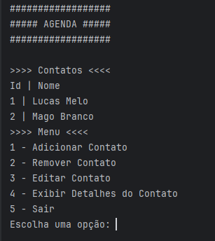

# Final Project - Agenda

Final project of Java Back End - Module I for Santander Coders 2023.2.
This application consists of an agenda, where the user can add, remove, and edit contacts, as well as view the list of phone numbers associated with each contact.

## Features

- Add a new contact with basic information (name, last name) and one or more phone numbers.
- Remove an existing contact.
- Edit the information of a contact, including name, last name, and phone numbers.
- Display details of a specific contact.
- Save contacts to a text file for data persistence.
- Load contacts from a text file.

## Project Structure
The project is structured into four main classes:

1. **Main.java**: This class contains the main `main` method, responsible for starting the application and interacting with the user through a menu of options.

2. **Contato.java**: Represents a contact in the phonebook. Each contact has a unique ID, name, last name, and a list of phone numbers.

3. **Agenda.java**: Implements the functionality of the phonebook, including operations such as adding, removing, editing, displaying, and saving contacts. Additionally, this class is also responsible for loading contacts from a file and saving contacts to a file.

4. **Telefone.java**: Represents a phone number, containing a DDD (area code) and a number.

## Usage Instructions

To use the application, simply execute the `main` method in the `Main.java` class. This will start the application and display a menu with available options. The user can then choose one of the options by typing the corresponding number and pressing Enter.


### Execution
1. Clone the repository to your local machine.
2. Open the terminal and navigate to the project directory. (or open it with your preferred IDE.)
3. Compile the source code by running the following command:
    ```
    javac Main.java
    ```
4. Execute the compiled file with the following command:
    ```
    java Main
    ```
5. Follow the instructions displayed in the console to interact with the application.

## Screenshot

*Application*




## Contribution

Feel free to contribute or report issues. Just open an issue or send a pull request.

## License

This project is licensed under the [MIT License] - see the [LICENSE.md](LICENSE.md) file for details.
